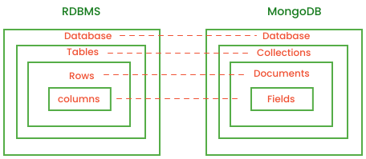

## MongoDB
- MongoDB is a source-available, cross-platform, document-oriented database program. Classified as a NoSQL database product, MongoDB utilizes JSON-like documents with optional schemas. MongoDB is developed by MongoDB Inc. and current versions are licensed under the Server Side Public License.

### The Shell
- to start mongodb
```
mongosh //to start

```
- to see all databases
```
show databases
or
show dbs
```
- to create & use a new database called "collage" 
```
use db_name
```
- to clear screen for windows and mac
```
ctrl + L //windows
cmd + K //mac
```
- `db` command show current selected database.
- **help** command gives you all commands available.show
- Quit the MongoDB shell
```
quit
or
exit
```
- mongo shell is like js shell. it recognizes js syntax example:
```javascript
1+2
"nabin".toUpperCase()
```
#### what is `test>` in your shell?
- When we run MongoDB shell. mongodb by default creates temporary database.
- By default created database by mongodb  is `test`.
##### Then why we use cmd `show dbs` test db is not visible.
- because test is temporary database.
- it is not stored permanently in memory.

##### create database in mongodb
```
use db-name
```
- If there is already database with same name we go inside the database.
- let's create  new db called college
```
test> use college
switched to db college
college> show dbs
admin       40.00 KiB
be_demodb  112.00 KiB
config     108.00 KiB
ecomm_db   144.00 KiB
local       80.00 KiB
newdb       72.00 KiB
college>
```
- collage is still temporary database why this?
- because db will permanent if there is any data present or inserted

### Store Data
- In mongodb data is stored in special format called `BSON` Format
- BASON is Binary JSON

#### Why BSON?
- It solves the problem with JSON.
1. JSON is text based format.
1. space inefficient
1. BSON gives more datatypes.
- you can go to JSON and BSON mongodb [website](https://www.mongodb.com/resources/basics/json-and-bson)
- BSON like js objects

### Collections
- **Document:** Mongo stores data in form of document (BSON docs)
- **Collection:** MongoDB stores document in collections.
- you can relate this with relational databases.
<br>


### INSERT in DB
- to see all collections
```
show collections
```
- you can prefer this [link](https://www.mongodb.com/docs/manual/crud/) to see crud operation docs

- Inserts a single document into a
collection.
```
db.collection.insertOne()
```
- Inserts multiple documents into a collection.
```
db.collection.insertMany()
```
##### If a collection does not exist, MongoDB creates the collection when you first store data for that collection.
- let's insert data
```javascript
db.student.insertOne({name:"nabin", marks:88})
```
- if you got this type of message you are ready to go
```javascript
{
  acknowledged: true,
  insertedId: ObjectId('66b25c08d7eb81d02e7ce55f')
}
```
#### Note
- `insertedId` is your primary key

#### to see all data inside that collection
```
db.student.find()
```
```javascript
[
  {
    _id: ObjectId('66b25c08d7eb81d02e7ce55f'),
    name: 'nabin',
    marks: 88
  }
]
```
- the data is in the array form
- let's insert one more data
```javascript
db.student.insertOne( {name:"john", city:"Palpa", marks:90} )
```
- i added one document called city
- in sql databases we have to first define schema first then insert data but in mongodb allow us to add any type of document

- now the schema and data looks like this:
```javascript
collage> db.student.find()
[
  {
    _id: ObjectId('66b25c08d7eb81d02e7ce55f'),
    name: 'nabin',
    marks: 88
  },
  {
    _id: ObjectId('66b25d72d7eb81d02e7ce560'),
    name: 'john',
    city: 'Palpa',
    marks: 90
  }
]
```
### INSERT Many data in DB
- again the command is
```javascript
insertMany(array of documents)

db.student.insertMany([{name:"sairaj",marks:98},{name:"adyatan", marks:99},{name:"hemanta", marks:99} ])
```

### FIND in DB
- commands
```javascript
db.collage.find() //returns everything

for specific queries
db.collage.find({key:value})
db.collage.findOne({key:value}) // gives only one value
```
- **find** function returns cursor
- cursor  is a reference not actual document
- **find** function returns actual document

### Query Operators
Q.Find student where marks >95
```javascript
db.student.find({marks:{$gt:95}})
```
Q.Find students who live in KTM or Palpa
```javascript
db.student.find({city:{$in:["KTM", "Palpa"]}})
```
Q.Find students who scored>75 or live in Palpa
```javascript
db.student.find({marks:{$or:[{marks:{$gt:75}}, {city:"Palpa"}]}})
```
- go to this [link](https://www.mongodb.com/docs/manual/reference/operator/) to read about operators