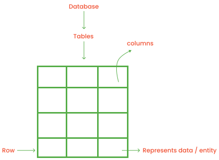
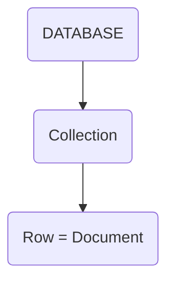
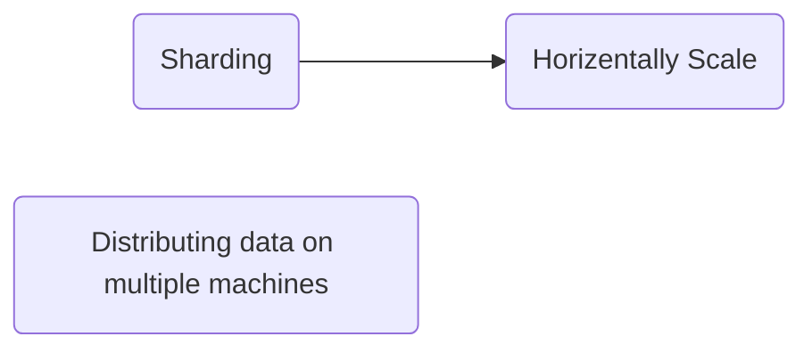

# MongoDB

|No.|TOC|No.|TOC|
|---|---|---|---|
|1.|[mongodb](#mongodb-1)|7.|[mongodb-server](#mongodb-server)|
|2.|[msql--oracle--rdbms](#msql--oracle--rdbms)|8.|[advantages-of-mongodb](#advantages-of-mongodb)|
|3.|[mongos--mongodb](#mongos--mongodb)|9.|[use-case-of-mongodb](#use-case-of-mongodb)|
|4.|[Rdbms-and-mongodb](#rdbms-and-mongodb)|10.|[sharding-in-mongodb](#sharding-in-mongodb)|
|5.|[documents-in-mongodb](#documents-in-mongodb)|11.|[data-modeling-in-mongodb](#data-modeling-in-mongodb)|
|6.|[collection-in-mongodb](#collection-in-mongodb)|12.|[embedded-data](#embedded-data)|

1. What is Mongodb?

    Mongodb is a database management system.
    - It allow you to store data.
    - Mongodb is management system to allow query.

1. Mongodb is it self

    1. Mongo -> Big / humongous
    1. DB    -> Database

1. Why Should learn Mongodb?
    1. To get flexible schema
    1. It is very good at storing huge amount of data
    1. Natively scalable
    1. flexible data, schema

1. In Sql Databases like **`RDBMS`** | `mysql` / `oracal` 
    - It will only work if its schema is fixed
    - It should have fixed schema

1. Nosql Databases like `Mongodb`

1. Data
    1. Data is called gold / new oil
    1. with data you can computation and generate information
    1. storage

#### MongoDB
1. Document oriented
1. Stores data in the forms of collections and documents
1. Gained popularity in mid 2000's

### Msql | oracle | RDBMS



|Data is stored in the form of rows|
|---|

### Mongos / MongoDB


## RDBMS AND MONGODB


#### Documents in MongoDB
1. Similar to JSON
1. Mango called it **`BSON`**
1. _id is unikely identifier like primary key

#### Collection in MongoDB
1. store document

    student Collection BSON looks like
    ``` 
    {
        name:"al",
        age:18,
        status: "D",
        group:["politics", "news"]
    }

    ```
#### MongoDB Server
1. In mongodb server you can make many databases
    1. d1, d2, d3, d4
1. d1 -> can have multiple collections
    1. c1, c2, c3, c4
1. c1 -> can have multiple documents 
    1. d1, d2, d3, d4


#### Advantages of MongoDB
1. Best of SQL and NOSQL
    ```mermaid 
    flowchart 
    
    A(RDBMS)
    A---AA(Scheme) ---C
    A---AB(Transection) ---C
    A---AC(Relationship) ---C

    B(NO SQL)
    B---BA(Flexible schema) ---C
    B---BB(Scalability) ---C
    
    C(MongoDB)
    C---CA(Both of SQL and NOSQL)
    CA---CAA(Features)
    ```
#### Use case of MongoDB
1. Produce data management
1. CMS(content management system) 
1. Operational Intelligence
1. Online Application

#### Sharding in MongoDB


#### Raplica sets in MongoDB
1. Raplica is storing data in more than one machine.

#### MongoDB is Scalable because
 1. Sharding
 1. Replica sets

#### How MongoDB stores Data
 1. Mongodb store data in the form of **`BSON`**
 1. BSON looks like -> `JSON`
 1. Binary JSON
 1. It is the binary sirilization over the JSON

#### Advantages of BSON
 1. Less Space
 1. Faster Traversal
    1. Improve quary speed
 1. Large number of Datatypes

### Data Modelling
- Data Types in MongoDB

1. Text
    1. String

1. Numberic
    1. 32-bit integer
    1. 64-bit integer
    1. Double
    1. Decimal128

1. Data / Time
    1. Data
    1. Timestamp

1. Others
    1. Object
    1. Array
    1. Binary Data
    1. ObjectID
    1. Boolean
    1. Null
    1. Regular Expression
    1. JavaScript
    1. Min Key
    1. Max Key

## Note
 - In MongoDB one document could be 16mb

#### Data Modeling in MongoDB
 ```mermaid 
 flowchart 

    A(Data Modeling)
    A---B(Entities)
    A---C(Relationship)
 
 ```

1. Entities Example
    1. Human
    1. Car
1. Relationship
    1. One to one
    1. one to Many
    1. Many to one
    1. Many to Many

- Example
 ```mermaid 
 flowchart LR

    A(Citizen)--- to ---B(citizinship)
    C(Country)--- To ---D(citizen)
    E(citizen)--- 2 ---F(Country)
    G(students)--- two ---H(teachers)

 
 ```

- In database we need to represent these relationship

### Embedded Data
1. Document nested inside another document is the example of embedded data
    1. Entities represent --> In the form of documents
    1. Relationship --> Between two entities
        - If one document is another document / data it represents relationship

#### References like Foreign Key
 ```mermaid 
 flowchart LR

    A(_id:objectid1)<--->B(_id:objectid1 <br> _id:objectid100)
    A<--->C(_id:objectid1 <br> _id:objectid200)
    
 
 ```